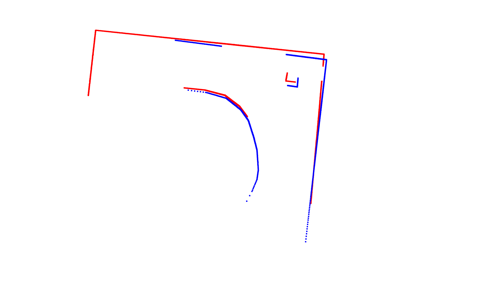
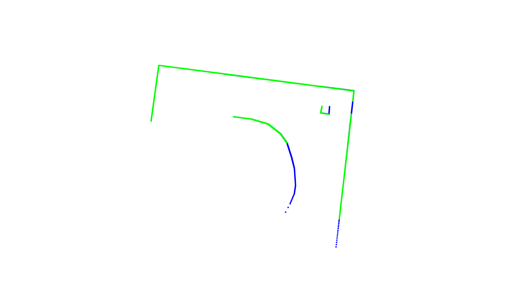
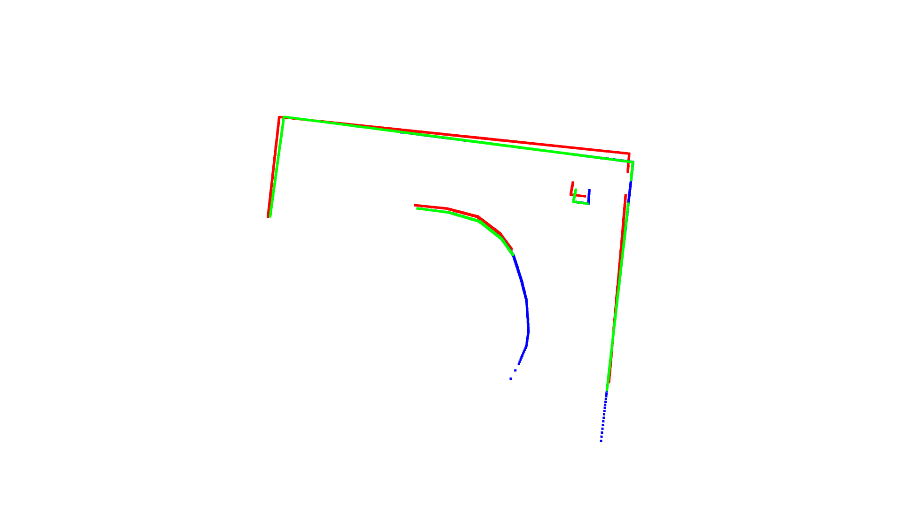
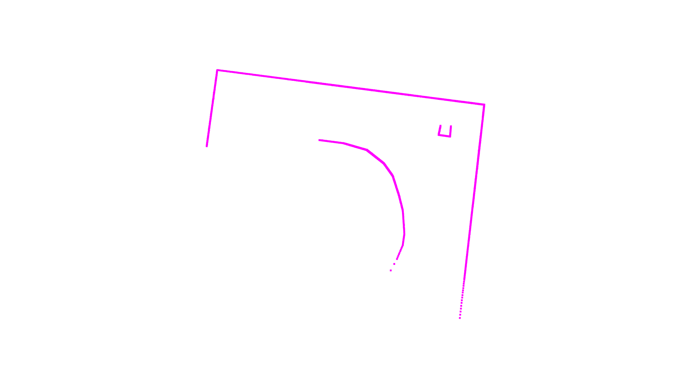

# Слияние 2D облаков
## Проект на C++
[Тут](https://github.com/PostRed/Cloud_Merging_Visualization/blob/main/CloudVisualization/main.cpp) можно посмотреть мои попытки работы с библиотекой [PCL](https://github.com/PointCloudLibrary/pcl). Сколько бы я не пробовала её переустанавливать на моем ноуте проект не запускался и в конце концов выскочила ошибка, что мое устройство не поддерживает pcl.

Так как писать алгоритм слияния облаков с нуля времени не было - я решила написать все на Python.

## Проект на Python

Для работы с облаками и визуализации использовалась библиотека [Open3D](https://www.open3d.org/docs/release/getting_started.html)

[Тут](https://github.com/PostRed/Cloud_Merging_Visualization/blob/main/cloud_merging.ipynb) лежит сам код.

## Визуализация

1. Для начала я решила слить первые два облака из папки clouds.
   
   Вот так два облака смотрятся вместе

  

2. Теперь нужно повернуть красное облако так, чтобы оно лучше всего подходило к синему

   Для этого воспользуемся алгоритмом [icp](https://www.open3d.org/docs/latest/python_api/open3d.pipelines.registration.registration_icp.html) который заложен в библиотеку Open3D. Чтобы алгоритм работал максимально корректно подберем наиболее подходящий параметр max_correspondence_distance (threshold). То есть определим максимальное расстояние между точками, чтобы считать их соответствующими.

   для этого переберем threshold в отрезке [0.01, 1] с шагом 0.05.

   [pcd файлы, полученные в результате перебора](https://github.com/PostRed/Cloud_Merging_Visualization/tree/main/thresholds1)
   
   [Картинки, полученные в результате перебора](https://github.com/PostRed/Cloud_Merging_Visualization/tree/main/pictures_thresholds1)

   Больше всего нам подгод порог = 0.55, которому соответствует данная картинка:

   (зеленое облако - это результат поворота красного)
   
  

3. Теперь посмотрим на исходные облака вместе с повернутым красным:

  

4. И сольем зеленое и синее облако в одно:

 
   

   
